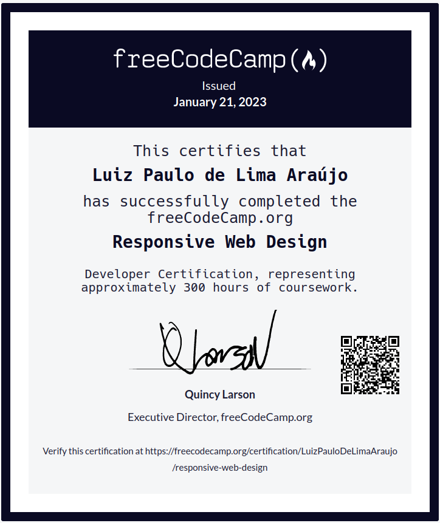

## Projetos de Certifição da FreeCodeCamp

    Projetos de Certificação da FreeCodeCamp
    Residem aqui. Eles fazem parte da Dinâmica
    do Curso Superior em Sistemas Para Internet
    Ministrado no segundo período por
    <a href="https://github.com/dev-alissonalves"> Álisson Alves </a>
    no Instituto Federal do Rio Grande do Norte

<figure>
  
  <figcaption>
    Certificado <i>Responsive Web Design</i>
  </figcaption>
</figure>

